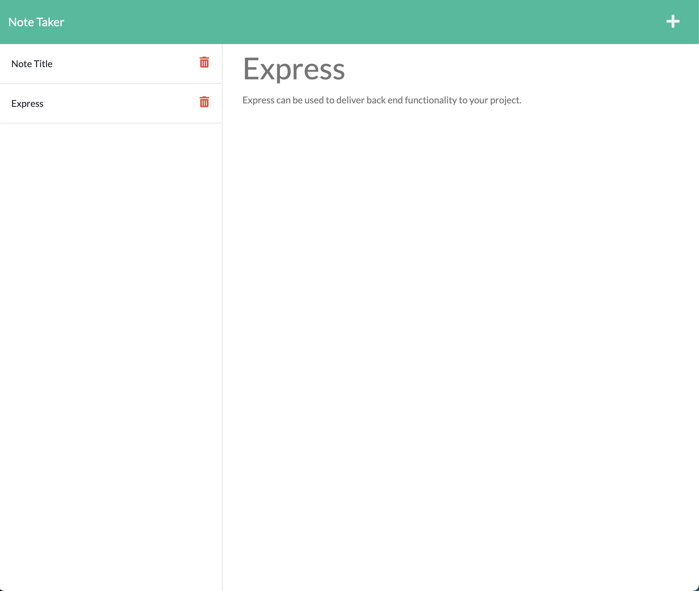

# Note Taker

## Task: To create an Express.js back end application given a starter code front end for taking notes.
* Goal: To exhibit an understanding of how express.js works by implimenting it to existing code.
* Specifications: The program must properly accept input from the user in the form of notes. Routes will need to be created to get and post new data to the json file which will be used as the database for this project.
* Points of Emphasis: The project will show an understanding of the back end communicates with the front end. The routes will need to be able to not only display and transfer the necessary information, but communicate with the front end event listeners in an intuitive manner.
* Completion: This project is completed when the application code is submitted, and the deployed link exhibiting its capabilies is posted here: https://rocky-chamber-97286.herokuapp.com/

* Application: 
